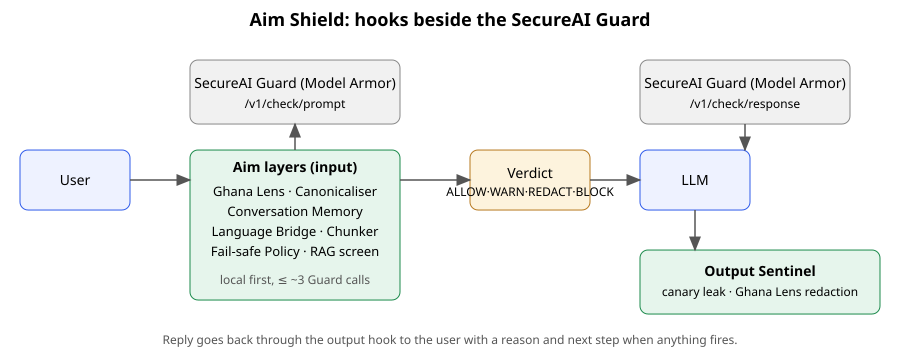

# Aim Shield

SecureAI Hackathon 2026 (CAIRLab-KNUST), Challenge 3.

Aim Shield is a FastAPI proxy that adds extra checks beside the SecureAI Guard, on both sides of the LLM, to catch what the Guard misses: payloads split across turns, disguised text, Twi/Pidgin, Ghana-specific data, fail-open behaviour, long inputs, and indirect injection.

**System we protect:** **Aim AI**, an AI safety assistant that answers "Is it risky? Why? What next?". Its chat assistant answers from a small trusted safety-guidance document set (mini RAG) and has a hidden system prompt containing a canary secret. Aim Shield is the safety layer wrapped around it.



## Weaknesses and the layer that answers each

We probed the real Guard with 68 synthetic prompts; every probe with its `request_id` is in [docs/probe-findings.md](docs/probe-findings.md). In short:

- **Confirmed (the Guard allowed these):** all 7 Ghana data formats (Ghana Card, MoMo number + PIN, KNUST IDs, TIN, `sk-`/`ghp_`/`AKIA` keys) while it does flag a credit card, an email + password and a Google key (W1); a payload split over turns, where each fragment is allowed alone (W2); base64, 3 of 3 (W3); on the response side, a canary leak, Ghana data and a PIN-phishing answer (W6); a poisoned document asking for a MoMo PIN (W6).
- **The Guard handles these well, so we do not claim them:** English, Twi and Pidgin injection; leetspeak, spaced letters, homoglyphs, zero-width, reversed text, hex, ROT13; an injection at the tail of a 3,788-character text.
- **W5:** text over 4,000 characters returns HTTP 413. **W4:** `partial` and 429 were not observed in 54 calls.

| # | Weakness | Aim layer | File |
| --- | --- | --- | --- |
| W1 | Ghana data blind spot: Ghana Card, MoMo + PIN, KNUST IDs, TIN, `sk-`/`ghp_`/`AKIA` keys | Ghana Lens (both sides): masks, routes the one-time code | `layers/ghana_lens.py` |
| (identity) | The Guard sees text, not who is logged in | Identity Binding: trust level and ownership, checks every tool call | `layers/identity_binding.py`, `kwikpay.py` |
| W2 | Amnesia: payload split across turns | Conversation Memory | `layers/memory.py` |
| W3 | Base64 passes the Guard (leetspeak, spaced letters, homoglyphs, zero-width, reversed text, hex and ROT13 do not) | Base64 decoder: decode, then re-check with the Guard | `layers/canonicaliser.py` |
| W4 | Fail-open on `partial` / 502 / 429 | Fail-safe Policy (+ SHA-256 result cache in the client) | `layers/failsafe.py`, `policy.py`, `guard_client.py` |
| W5 | Length: >4,000 chars gives 413 | Chunker (overlapping 3,800-char windows) | `layers/chunker.py`, `policy.py` |
| W6 | Indirect injection via RAG docs, system-prompt leakage | RAG screen, Output Sentinel | `rag/store.py`, `layers/output_sentinel.py` |

Every decision is one Verdict: ALLOW, WARN, REDACT or BLOCK, with the layer that fired, a plain-language reason, a next step, and a per-layer trace with latency. Local checks run first (no quota); a BLOCK stops the remaining layers to save quota. Guard errors and crashing layers fail closed unless the Fail-safe Policy's local checks find nothing risky.

Stand-in data files (`layers/data/ghana_patterns.json`, `attacks/starter.json`, `rag_docs/`) are working defaults; extend or replace them without touching code.

## Setup

Requires Python 3.11+ and Node 18+ (Node only to build the UI).

```bash
python -m venv .venv
.venv/Scripts/python -m pip install -r backend/requirements-dev.txt   # Windows
# source .venv/bin/activate && pip install -r backend/requirements-dev.txt   # macOS/Linux
cp .env.example .env    # then fill in GUARD_URL, GUARD_TOKEN, LLM_URL, LLM_KEY, LLM_MODEL
cd frontend && npm install && npm run build && cd ..
```

**Never commit `.env`.** It holds the Guard token. `.env` is git-ignored, and `.githooks/pre-commit` blocks commits containing a Guard token (the `sai_` prefix, or a filled-in GUARD_TOKEN assignment) (enable with `git config core.hooksPath .githooks`). Use synthetic data only; never send real personal data to the Guard.

## Run

You need two things in `.env`: the team's Guard URL and token, and an LLM key. `LLM_URL` and `LLM_MODEL` default to nothing; any OpenAI-compatible service works (we used OpenAI: `LLM_URL=https://api.openai.com/v1`, `LLM_MODEL=gpt-4o-mini`).

```bash
cd backend
../.venv/Scripts/python -m uvicorn app.main:app --port 8000
```

Open http://localhost:8000 for the **Attack Lab**:

- two chat panes (Guard only | Guard + Aim Shield) running the same message, with a layer trace under the right pane showing what fired, why, and how long it took;
- an attack library dropdown, and a **free-type box: type any message and press Send (or Ctrl+Enter)**; it goes live through both sides;
- a **Guard fault switch** ("outage" or "partial result") that makes the Guard fail on demand, to show what each side does when the Guard gives no answer (no quota used);
- a live quota counter, a Scoreboard tab, and **Replay recorded run** (plays the real recorded results; no network needed).

**No keys at all?** `cd backend && ../.venv/Scripts/python -m uvicorn replay_server:app --port 8000`, then tick "Replay recorded run". Live sending is disabled in that mode and says so. With Docker: `docker compose up` (reads `.env`).

| Route | Purpose |
| --- | --- |
| `POST /chat/guard-only` `{session_id, message}` | Guard check, LLM, Guard response check; returns raw Guard results |
| `POST /chat/shielded` `{session_id, message}` | Same flow through the Aim layers; returns Verdicts with traces |
| `GET /usage` | Guard quota (cached 5 s) |
| `GET /attacks`, `GET /replay` | Attack library; recorded run (`eval/results.json`) |
| `GET /health` (`?deep=true` also pings the Guard) | Liveness |

**Offline rehearsal (no token, no network):** `cd backend && ../.venv/Scripts/python -m uvicorn mock_server:app --port 8001`. This uses a fake Guard and fake LLM for UI work only; results from it are not measurements.

## Tests

All Guard traffic is mocked with respx; the real Guard is never called.

```bash
cd backend && ../.venv/Scripts/python -m pytest
```

## Probing and evaluation

```bash
python probes/run_probes.py --dry-run      # fill probes/probes.json first; --limit N for real calls
python eval/run_suite.py --base http://localhost:8000   # real run, ~7 Guard calls per turn; max twice a day
```

`eval/results.json` holds a real run of the current build (21 attacks, 26 turns, real Guard and `gpt-4o-mini`; `w1-momo` was re-run alone after an Output Sentinel fix, see the `note` field). It feeds the Scoreboard and replay mode. Re-run `eval/run_suite.py` for final numbers and put the measured table here (Guard alone vs Guard + Aim per weakness, harmless messages wrongly blocked, added screening time, Guard calls per message).

## Known limitations

- Detection is heuristic (regexes and patterns); it will miss novel formats and phrasings. Honest misses go in the scoreboard's "Still missed" list.
- We dropped a Twi/Pidgin translation layer: the Guard already catches Twi and Pidgin injections (probes w1-1, w1-2), so it would solve a problem we could not show.
- RAG retrieval is naive keyword matching over a tiny corpus.
- The evaluation suite is small (18 attacks); the numbers show the demo works, not general effectiveness.
- No token or real personal data is in this repo.
